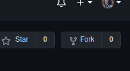
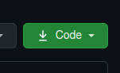
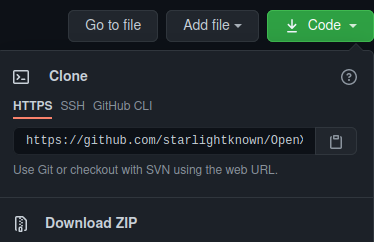

[](https://github.com/firstcontributions/open-source-badges)
[](https://opensource.org/licenses/MIT)

## OpenX 

**A site for first time contributors to start their journey in open source**
# First Contributions

This project aims to simplify and guide the way beginners make their first contribution. If you are looking to make your first contribution, follow the steps below.



#### If you don't have git on your machine, [install it](https://help.github.com/articles/set-up-git/).

## Fork this repository

Fork this repository by clicking on the fork button on the top of this page.
This will create a copy of this repository in your account.

## Clone the repository



Now clone the forked repository to your machine. Go to your GitHub account, open the forked repository, click on the code button and then click the _copy to clipboard_ icon.

Open a terminal and run the following git command:

```
git clone "url you just copied"
```

where "url you just copied" (without the quotation marks) is the url to this repository (your fork of this project). See the previous steps to obtain the url.



For example:

```
git clone https://github.com/this-is-you/OpenX.git
```

where `this-is-you` is your GitHub username. Here you're copying the contents of the first-contributions repository on GitHub to your computer.

## Create a branch

Change to the repository directory on your computer (if you are not already there):

```
cd OpenX
```

Now create a branch using the `git checkout` command:

```
git checkout -b your-new-branch-name
```

For example:

```
git checkout -b add-alonzo-church
```

(The name of the branch does not need to have the word _add_ in it, but it's a reasonable thing to include because the purpose of this branch is to add your name to a list.)

## Make necessary changes and commit those changes

Now open `team.html` file in a text editor, Add your name, a short bio and your social links (optional) in `team.html` file.
Replace "your name" inside `<h2>`tags, add your bio inside `<p>`tags and add your social links (optional) inside `href="your link here"`
Now go to img folder and check out two avatars, come back to `team.html` and put your avatar link after img/  `

If you go to the project directory and execute the command `git status`, you'll see there are changes.

Add those changes to the branch you just created using the `git add` command:

```
git add team.html
```

Now commit those changes using the `git commit` command:

```
git commit -m "Add <your-name> to Contributors list"
```

replacing `<your-name>` with your name.

## Push changes to GitHub

Push your changes using the command `git push`:

```
git push origin <add-your-branch-name>
```

replacing `<add-your-branch-name>` with the name of the branch you created earlier.

## Submit your changes for review

If you go to your repository on GitHub, you'll see a `Compare & pull request` button. Click on that button.


Now submit the pull request.


Soon I'll be merging all your changes into the master branch of this project. You will get a notification email once the changes have been merged.

## Where to go from here?

Congrats! You just completed the standard _fork -> clone -> edit -> pull request_ workflow that you'll encounter often as a contributor!

Celebrate your contribution and share it with your friends and followers by going to [web app](https://starlightknown.github.io/OpenX/team.html)


